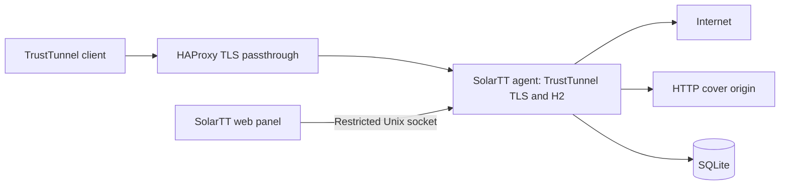

# SolarTT-UI

**Independent, self-hosted management for TrustTunnel.**

User provisioning, traffic quotas, expiry, profile export, and individual session
revocation, with a lightweight web interface. Community project, not an official
TrustTunnel product.

## Development status

Version 0.1 is under development. No production deployment or stability claims.
Release gates include per-user TCP/UDP quotas, closure of that user's TLS sessions
without interrupting another user, crash recovery, client compatibility and
installation on a clean VM.

## Architecture



The initial scope is one Linux x86_64 node, HTTP/2, TCP and UDP. IPv6, QUIC,
ICMP, speed shaping, payments and multi-node orchestration are outside v0.1.
Quota means forwarded payload in both directions, not the provider's network bill.

## Build prerequisites

Rust 1.95.0, Python 3, a C/C++ compiler, CMake and libclang. Heavy native builds
run in CI; production nodes receive packaged binaries.

```sh
python3 scripts/prepare_upstream.py
cargo test
# Native/network tests require the full C/C++ toolchain:
cargo test -p solartt-agent
```

See [architecture](docs/architecture.md), [release gates](docs/release-gates.md),
[installation](docs/install.md), [backup and upgrade](docs/backup-upgrade.md),
[contributing](CONTRIBUTING.md) and [security](SECURITY.md).

## License

Apache-2.0. TrustTunnel retains its upstream copyright and license. Derived
builds identify their exact upstream commit and patch set.
